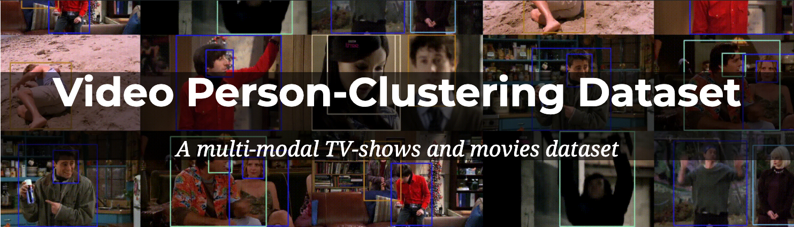

# Video Person Clustering
Repo for the [Video Person Clustering dataset](https://www.robots.ox.ac.uk/~vgg/data/Video_Person_Clustering/), and code for the associated paper. This reporsitory contains the Video Person Clustering Dataset (below), and the code (coming soon...) from the associated paper, for the task of video person-clustering

## [Video Person Clustering Dataset (VPCD)](https://www.robots.ox.ac.uk/~vgg/data/Video_Person_Clustering/)



The dataset can be downloaded [here](https://www.robots.ox.ac.uk/~abrown/VPCD.tar.gz). The tar.gz file contains the dataset, and a README detailing the contents

VPCD is built upon popular video datasets that are commonly used in the Computer Vision community (e.g. [TBBT](http://tvd.niderb.fr/assets/pdf/lrec2014.pdf), [Buffy](https://www.robots.ox.ac.uk/~vgg/publications/papers/everingham06a.pdf), [Friends](https://www.robots.ox.ac.uk/~vgg/research/c1c/src/VickyKalogeitonBMVC2020.pdf), [Sherlock](https://www.robots.ox.ac.uk/~vgg/publications/2017/Nagrani17b/nagrani17b.pdf), [About Last Night](https://arxiv.org/pdf/2008.11289.pdf), [Hidden Figures](https://arxiv.org/pdf/2008.11289.pdf)) 

## Code

The code to produce video person-clustering results: Coming soon...

## Important Notes

Details for the raw resolution of the videos, and the frame rates used in the dataset, can be found in [this document](https://docs.google.com/document/d/1YTqU2V6Abkei1GlupFCinPH1-9T8NyTuzMni9h5YKAw/edit?usp=sharing)

Currently the available dataset does not have the exact statistics quoted in the paper. A corrected version will be made available soon

## Paper

If you find VPCD, or the code useful, please consider citing:

```
@misc{brown2021face,
      title={Face, Body, Voice: Video Person-Clustering with Multiple Modalities}, 
      author={Andrew Brown and Vicky Kalogeiton and Andrew Zisserman},
      year={2021},
      eprint={2105.09939},
      archivePrefix={arXiv},
      primaryClass={cs.CV}
}
```

